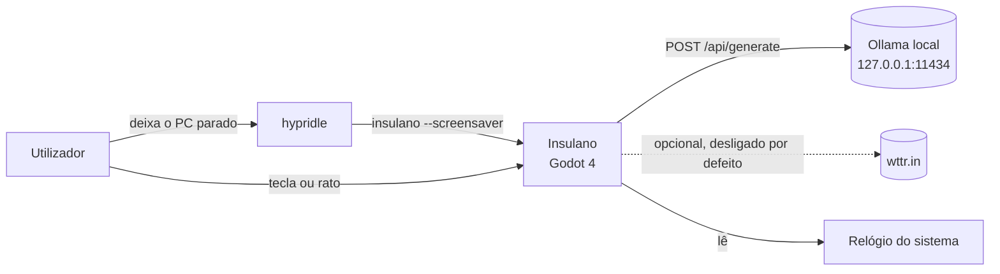
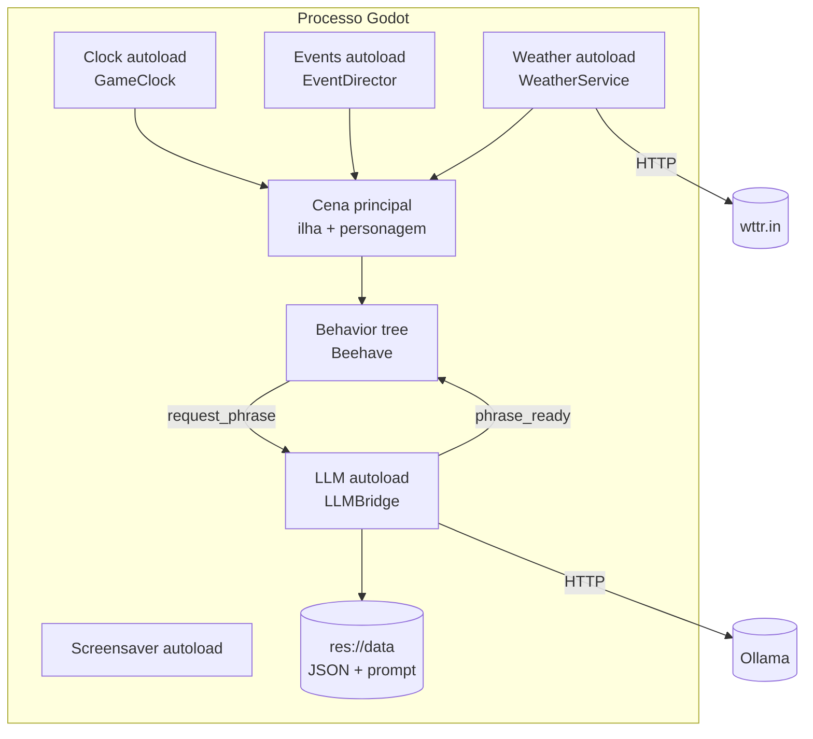
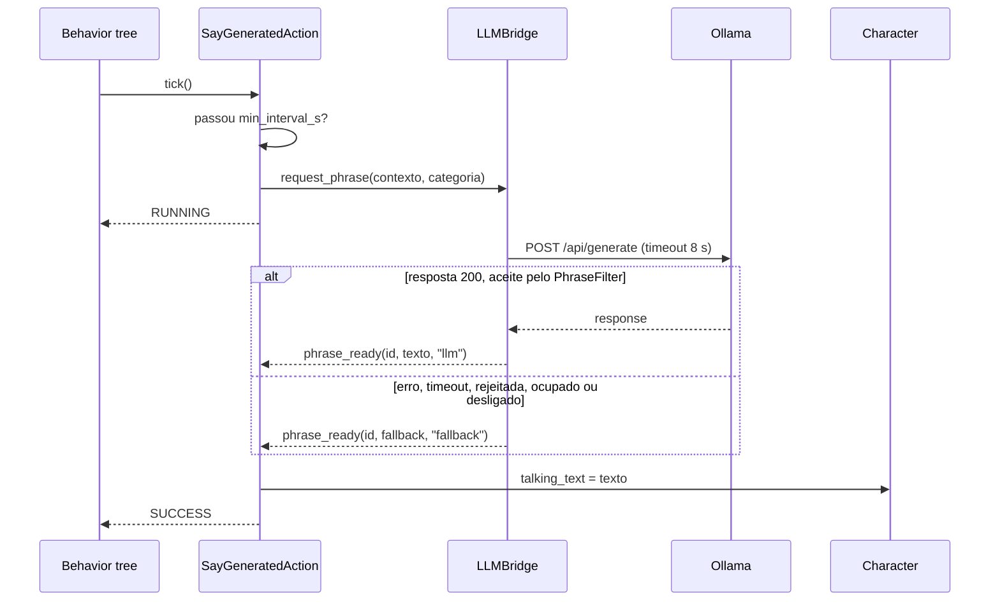

# Arquitectura: Insulano

arc42 lite com C4. Os contratos detalhados (assinaturas, sinais, settings) vivem em
[`../agent_docs/tech_design.md`](../agent_docs/tech_design.md); aqui fica a forma do sistema e o porquê.
A secção 4.3 é gerada a partir do código por `python3 scripts/check_docs.py --fix` e o portão falha se
estiver desactualizada.

## 1. Objectivo e atributos de qualidade

Protector de ecrã 2D com um personagem autónomo que fala com a ajuda de um LLM local.

Atributos, por prioridade:

1. **Resiliência:** funciona igual sem Ollama e sem internet.
2. **Leveza:** 60 fps num portátil sem aquecer; um pedido ao LLM a cada 30 s no máximo.
3. **Verificabilidade:** cada comportamento tem prova automática que um agente corre sozinho.
4. **Privacidade:** nada sai da máquina por defeito.
5. **Manutenibilidade:** núcleo puro testável, dados fora do código.

## 2. Contexto (C4 nível 1)

## 3. Estratégia de solução

| Decisão | Porquê | ADR |
|---|---|---|
| Godot 4 a partir do Guy on Island, em `game/` | base funcional com behavior trees | ADR-001, ADR-004 |
| Ollama local por HTTP, fallback obrigatório | zero custo, privacidade | ADR-002, ADR-006 |
| Behavior tree decide, LLM só fala | o personagem nunca depende da IA para agir | ADR-002 |
| Núcleo puro + casca de cena | testes rápidos e determinísticos | ADR-005 |
| Dados e prompt em JSON e texto, partilhados com o eval | jogo e medição nunca divergem | ADR-008 |
| Arranque pelo hypridle | Wayland não tem API de protector | ADR-009 |

## 4. Vista de blocos

### 4.1 Containers (C4 nível 2)

Estado a 2026-09-13: existem a cena principal e a behavior tree herdadas; os autoloads são planeados
(tabela de estado em `tech_design.md` §2).

### 4.2 Componentes da camada LLM (C4 nível 3)

| Componente | Responsabilidade | Não faz |
|---|---|---|
| `LLMSettings` | lê configuração com precedência env, `.cfg`, projecto | rede |
| `PhraseContext` | descreve o momento (hora, acção, fome, tempo, feriado) | decidir |
| `PromptBuilder` | preenche o template partilhado | falar com o Ollama |
| `PhraseFilter` | aceita ou rejeita frases pelas regras partilhadas | escolher fallback |
| `FallbackPhrases` | escolhe frase fixa por categoria sem repetição imediata | rede |
| `LLMBridge` | único cliente HTTP do Ollama, timeout, fallback garantido | lógica de jogo |
| `SayGeneratedAction` | liga a behavior tree à ponte, respeita o intervalo | desenhar o balão |

### 4.3 Mapa de componentes do código (gerado)

<!-- gerado:componentes:inicio -->
| Ficheiro (game/) | class_name | extends | Responsabilidade (1.ª linha ##) |
|---|---|---|---|
| `beehave/action_using_delta.gd` | ActionUsingDelta | ActionLeaf | Base para acções do Beehave que precisam do delta do frame corrente. |
| `beehave/find_group_spot_condition.gd` | FindGroupSpotCondition | ConditionLeaf | Escolhe ao acaso um nó do grupo `group_name` e grava a posição no blackboard. |
| `beehave/find_random_spot_condition.gd` | FindRandomSpotCondition | ConditionLeaf | Escolhe um ponto aleatório navegável do `NavigationServer2D` e grava-o no blackboard. |
| `beehave/find_usable_for_need_condition.gd` | FundUsableForNeedCondition | ConditionLeaf | Encontra, entre os objectos utilizáveis dentro de `search_area`, o que melhor |
| `beehave/fishing_action.gd` | FishingAction | ActionUsingDelta | Acção de pescar: mostra a cana, espera um tempo aleatório e faz nascer um peixe. |
| `beehave/go_to_usable_action.gd` | GoToUsableAction | ActionLeaf | Move o actor até à posição em `blackboard_key`, usando o `NavigationAgent2D` do Character. |
| `beehave/need_low_condition.gd` | NeedLowCondition | ConditionLeaf | Sorteia, para cada necessidade do actor, se está baixa o suficiente para tratar agora. |
| `beehave/set_delta_on_blackboard.gd` | SetDeltaOnBlackboardAction | ActionLeaf | Escreve o delta do frame corrente no blackboard, para outras folhas o lerem. |
| `beehave/talk_action.gd` | TalkAction | ActionLeaf | Escolhe ao acaso uma frase de `texts` e escreve-a em `character.talking_text`. |
| `beehave/use_usable_action.gd` | UseUsableAction | ActionUsingDelta | Usa o objecto em `object_blackboard_key` enquanto a necessidade associada não estiver satisfeita. |
| `beehave/watch_ocean_action.gd` | WatchOceanAction | ActionUsingDelta | Faz o actor "olhar o mar" durante um tempo aleatório entre os dois limites. |
| `character/character.gd` | Character | CharacterBody2D | Personagem base: necessidades, navegação, animação por direcção e balão de fala. |
| `character/need.gd` | Need | Resource | Um recurso de necessidade (fome, energia, ...) com valor actual e máximo. |
| `fishing_spot.gd` | - | Node2D | Marcador visual de um ponto de pesca: desenha um círculo vermelho na cena. |
| `guy/direction.gd` | Direction | Object | Uma das quatro direcções cardinais, usada para escolher animação (walk_up, |
| `guy/guy.gd` | Guy | Character | O náufrago jogável: um Character que perde fome com o tempo. |
| `need_bar.gd` | NeedBar | ProgressBar | Barra de progresso que reflecte uma necessidade (`need_name`) de `target`. |
| `object/general_usable_object.gd` | GeneralUsableObject | UsableObject | Objecto utilizável que declara, em `satisfying_needs`, quais necessidades trata. |
| `object/need_replentishing_unsable.gd` | NeedReplentishingUsable | GeneralUsableObject | Objecto que repõe uma necessidade enquanto durar (ex.: o peixe apanhado). |
| `object/usable_object.gd` | UsableObject | Node2D | Base de qualquer objecto que a behavior tree pode usar para satisfazer necessidades. |
| `object/usable_object_container.gd` | UsableObjectContainer | UsableObject | Agrupa vários objectos utilizáveis num só nó (ex.: uma prateleira com comida). |
| `tools/boot_smoke.gd` | - | SceneTree | Smoke de arranque: carrega a cena principal, simula tempo de jogo e verifica |
| `tools/capture.gd` | - | SceneTree | Captura de prova visual: carrega uma cena com renderização real dentro de um |
<!-- gerado:componentes:fim -->

## 5. Vista de runtime

### 5.1 Uma frase, do tick à fala

### 5.2 Arranque como protector (Linux)

1. O hypridle detecta inactividade e executa `insulano --screensaver`.
2. `ScreensaverMode` põe fullscreen e esconde o cursor; a cena principal arranca.
3. Primeiro input depois de 1 s de graça: o processo termina. O hypridle trata do resto.

## 6. Conceitos transversais

- **Configuração:** `ProjectSettings` com prefixo `insulano/`, sobreposição em `user://settings.cfg`,
  variáveis `INSULANO_*` para testes.
- **Erros:** nunca propagam para o jogador; cada porta externa degrada para um valor seguro
  (frase de fallback, clima `unknown`).
- **Logging:** `print` com prefixo `[Insulano/<subsistema>]`; `push_error` para estados impossíveis.
- **Idioma:** texto visível só em pt-PT; identificadores em inglês.
- **Determinismo:** relógio, clima e aleatoriedade com costuras de teste.

## 7. Decisões

Registo completo em [`decisions.md`](decisions.md): ADR-001 a ADR-011.

## 8. Riscos e dívida técnica

| Item | Tipo | Plano |
|---|---|---|
| Bugs latentes da base (sinal trocado, `FAILED`, índice -1, print por tick, `.name` sobre `Array[String]` em `need_replentishing_unsable.gd`, `else` morto em `go_to_usable_action.gd`) | dívida | T-003 |
| Frases fixas da base em inglês | dívida | T-106 |
| Ollama só em CPU (p50 2,82 s) | risco de desempenho | aceitável com fallback; GPU é decisão do Rodolfo |
| Ollama publicado em `0.0.0.0:11434` | risco de segurança | `threat_model-propostas.md` P-01 |
| Beehave imprime erros de debugger em headless | ruído | ignorado nos logs; reavaliar na T-005 |
| Repositório sem remoto e `/home` sem snapshots | risco de perda | `threat_model-propostas.md` P-05 |
